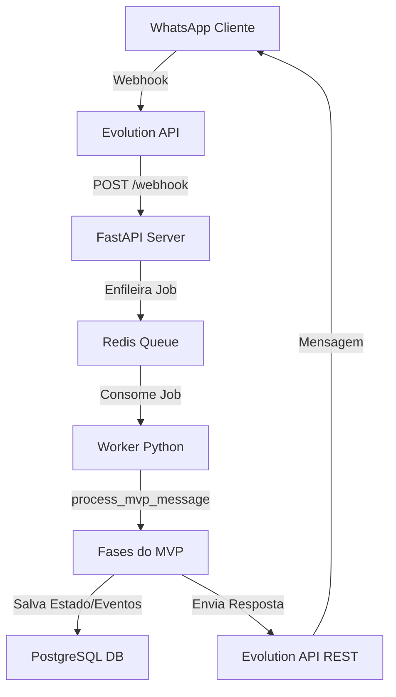

# Arquitetura Técnica do MVP Refrimix

Este documento descreve o fluxo de processamento de mensagens no MVP determinístico, detalhando a pipeline de ponta a ponta desde a recepção do evento do WhatsApp até a resposta ao cliente.

## 1. Fluxo de Dados de Ponta a Ponta

### Passo 1: Recepção e Ingestão
- A mensagem do cliente chega aos servidores do WhatsApp e é entregue via Webhook à **Evolution API**.
- A Evolution API repassa o payload formatado para a rota `/webhook` exposta pelo serviço **FastAPI** do bot.

### Passo 2: Enfileiramento Resiliente
- O endpoint FastAPI parseia os metadados mínimos (remetente, texto, tipo de mensagem) e publica o evento em uma fila de mensagens gerenciada pelo **Redis**.
- Isso garante que nenhuma mensagem de cliente seja perdida em caso de picos de carga ou reinicializações do worker.

### Passo 3: Processamento pelo Worker
- O **Worker Python** assíncrono consome as mensagens do Redis de forma sequencial.
- Ele delega a mensagem do lead para o pipeline determinístico em `process_mvp_message` localizado em `app/mvp_attendance.py`.

### Passo 4: Fases de Decisão e Classificação
Quando `MINIMAL_MVP_ENABLED=1`, a tomada de ação não utiliza LangGraph pesado ou LLMs:
1. **Identificação**: Carrega ou cria o cadastro do Lead pelo telefone no banco.
2. **Extração básica**: Mapeia se na mensagem o cliente enviou o nome, tipo de serviço ou preferências.
3. **Classificação (Intent)**: `understand_message` classifica a intenção em um conjunto fechado de intents determinísticas usando expressões regulares e regras de correspondência exata de palavras.
4. **Planejamento comercial**: `plan_next_action` decide qual a próxima ação baseando-se estritamente na árvore lógica de prioridades do MVP.
5. **Formatação (Catálogo)**: `response_catalog` gera a resposta final baseada no template exato do catálogo, garantindo copy impecável e livre de segredos.

### Passo 5: Persistência e Envio
- O estado do lead (`lead_state`) e os eventos da conversa são persistidos de forma assíncrona na tabela `leads` do **PostgreSQL**.
- A mensagem de resposta finalizada é disparada de volta ao cliente chamando os endpoints REST da **Evolution API**.
