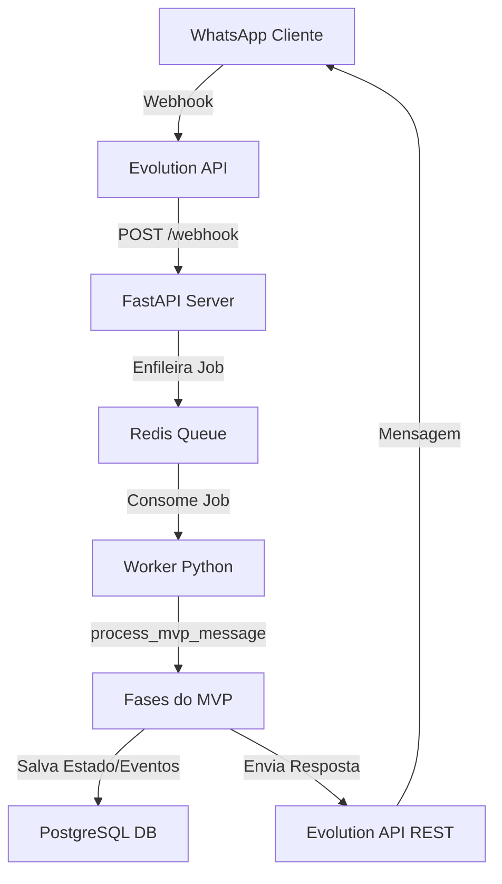

<!-- GENERATED FILE: do not edit manually. Source: .context/docs/*.md. Run ./sync.sh. -->
> Auto-generated from .context/docs | fingerprint: 0bc33f123b74f33c
## architecture

# Arquitetura Técnica do MVP Refrimix

Este documento descreve o fluxo de processamento de mensagens no MVP determinístico, detalhando a pipeline de ponta a ponta desde a recepção do evento do WhatsApp até a resposta ao cliente.

## 1. Fluxo de Dados de Ponta a Ponta



### Passo 1: Recepção e Ingestão
- A mensagem do cliente chega aos servidores do WhatsApp e é entregue via Webhook à **Evolution API**.
- A Evolution API repassa o payload formatado para a rota `/webhook` exposta pelo serviço **FastAPI** do bot.

### Passo 2: Enfileiramento Resiliente
- O endpoint FastAPI parseia os metadados mínimos (remetente, texto, tipo de mensagem) e publica o evento em uma fila de mensagens gerenciada pelo **Redis**.
- Isso garante que nenhuma mensagem de cliente seja perdida em caso de picos de carga ou reinicializações do worker.

### Passo 3: Processamento pelo Worker
- O **Worker Python** assíncrono consome as mensagens do Redis de forma sequencial.
- Ele delega a mensagem do lead para o pipeline determinístico em `process_mvp_message` localizado em `app/mvp_attendance.py`.

### Passo 4: Fases de Decisão e Classificação
Quando `MINIMAL_MVP_ENABLED=1`, a tomada de ação não utiliza LangGraph pesado ou LLMs:
1. **Identificação**: Carrega ou cria o cadastro do Lead pelo telefone no banco.
2. **Extração básica**: Mapeia se na mensagem o cliente enviou o nome, tipo de serviço ou preferências.
3. **Classificação (Intent)**: `understand_message` classifica a intenção em um conjunto fechado de intents determinísticas usando expressões regulares e regras de correspondência exata de palavras.
4. **Planejamento comercial**: `plan_next_action` decide qual a próxima ação baseando-se estritamente na árvore lógica de prioridades do MVP.
5. **Formatação (Catálogo)**: `response_catalog` gera a resposta final baseada no template exato do catálogo, garantindo copy impecável e livre de segredos.

### Passo 5: Persistência e Envio
- O estado do lead (`lead_state`) e os eventos da conversa são persistidos de forma assíncrona na tabela `leads` do **PostgreSQL**.
- A mensagem de resposta finalizada é disparada de volta ao cliente chamando os endpoints REST da **Evolution API**.

---

## context

# Entendimento Macro do MVP Refrimix

Este documento define a visão de negócios e o objetivo central do MVP (Minimum Viable Product) de atendimento automático via WhatsApp para a Refrimix.

## 1. Por que reduzimos o escopo?

O projeto anterior continha uma infraestrutura complexa com múltiplos agentes inteligentes, processamento de áudio por inteligência artificial (TTS/STT), análise multimodal de imagens via Vision (Qwen-VL), roteamento avançado via Qdrant e suporte a calendários externos. 

Embora robusta tecnicamente, essa arquitetura causava:
- **Loops Conversacionais**: Clientes ficavam presos em fluxos repetitivos de perguntas sobre fotos e infraestrutura.
- **Respostas Lentificadas**: Latências de processamento dos modelos de linguagem atrasavam as respostas do atendimento.
- **Erros de Interpretação**: Mudanças sutis de contexto geravam saídas erráticas dos LLMs.

Para garantir **velocidade, estabilidade e clareza**, eliminamos as inteligências artificiais complexas do caminho crítico, transformando o bot em um sistema de decisão determinístico baseado em intents claras e respostas unificadas no catálogo.

## 2. Objetivo Principal

O objetivo central do MVP é realizar um **pré-atendimento rápido e eficiente**, guiando o cliente até duas conclusões possíveis:
1. **Instalação Simples**: Apresentar o preço fixo de **R$850** quando todos os requisitos forem atendidos.
2. **Visita Técnica / Projeto**: Agendar uma visita presencial por **R$50** caso falte alguma informação (fotos, capacidade) ou seja um serviço de manutenção/conserto.

## 3. Persona do Cliente

O cliente da Refrimix busca soluções rápidas para climatização de sua residência ou comércio. Ele quer saber **quanto custa** e **quando pode ser feito**. O bot deve se comunicar de forma amigável, clara e objetiva, evitando termos técnicos desnecessários e direcionando para o agendamento rápido sem criar bloqueios (como exigir obrigatoriamente o envio de fotos).

---

## database

# Governança de Banco de Dados e lead_state

Este documento descreve a persistência de dados no MVP, detalhando a estrutura das tabelas principais e o esquema interno da coluna JSON de controle de estado.

## 1. Schema Físico (PostgreSQL)

O bot utiliza a tabela `leads` no PostgreSQL para registrar os atendimentos e seu ciclo de vida.

### Tabela `leads`
- `id` (String / UUID): Identificador único do lead.
- `phone` (String, Unique): Número de telefone do cliente no formato internacional (ex: `5513999999999`).
- `name` (String, Nullable): Nome do cliente, extraído deterministicamente.
- `service_type` (String, Nullable): Mapeamento de serviço ativo (`instalacao`, `higienizacao`, `manutencao`, `conserto`).
- `pipeline_stage` (String): Estágio do funil de atendimento (`new`, `awaiting_service`, `awaiting_name`, `pre_agendamento`, `qualified`).
- `city_bairro` (String, Nullable): Município e bairro onde o serviço será executado.
- `lead_state` (JSONB): O estado persistente da conversa, contendo informações comerciais detalhadas.

### Tabela `lead_events`
- Registra cada mensagem enviada (`user` ou `assistant`) associada ao telefone do lead, servindo de base histórica e protegendo a integridade do pipeline conversacional.

---

## 2. Estrutura do `lead_state` (JSON)

A coluna `lead_state` guarda as variáveis que controlam o comportamento do bot em tempo de execução de forma simples e legível:

```json
{
  "nome": "Will",
  "tipo_servico": "instalacao",
  "cidade_bairro": "Guarujá - Centro",
  "btus": "12000 BTUs",
  "fotos": {
    "local_interno": true,
    "local_externo": false
  },
  "instalacao": {
    "ponto_eletrico_exclusivo": true,
    "tubulacao_existente": false,
    "distancia_aproximada": "3m"
  },
  "commercial_decision": {
    "path": "technical_visit_50",
    "visit_price": 50,
    "fixed_price": null,
    "can_schedule_now": true
  },
  "appointment": {
    "preferred_window": "tarde",
    "confirmed_window": false
  },
  "pipeline_stage": "pre_agendamento",
  "last_messages": {
    "user": "quero agendar para tarde",
    "assistant": "Seguimos como visita técnica de R$50..."
  }
}
```

---

## 3. Diretrizes de Schema e Migrations

- **Regra estrita**: Não criar novas tabelas físicas ou colunas sem plano prévio do comitê de infraestrutura.
- A coluna `lead_state` é do tipo `JSONB` especificamente para permitir a expansão de campos virtuais (ex: preferências de data ou detalhes de faturamento) sem a necessidade de rodar migrations de banco de dados (`prisma migrate`), mantendo o banco estável e sem riscos de indisponibilidade.
- Qualquer verificação de schema físico em ambiente local deve usar o validador de ambiente `.venv/bin/python scripts/validate-env.py`.

---

## decisions

# Decisões e Regras Comerciais do MVP

Este documento consolida todas as políticas comerciais oficiais adotadas pela Refrimix no MVP. Essas regras são codificadas no bot de forma determinística para evitar divergências de orçamentação.

## 1. Tabela de Preços Oficial

| Tipo de Serviço | Condições do Cenário | Preço Cobrado | Observações comerciais |
| :--- | :--- | :--- | :--- |
| **Instalação Simples** | Costa a costa, evaporadora e condensadora próximas, até 3m de tubulação, acesso fácil. | **R$ 850,00** | Inclui material básico e mão de obra. Considera ponto elétrico pronto. |
| **Higienização** | Split padrão (hi-wall), equipamento funcionando e instalado corretamente. | **R$ 200,00 / aparelho** | Se o aparelho não climatizar, vira análise de manutenção por R$50. |
| **Visita Técnica / Análise** | Manutenção geral, conserto de vazamentos, ou instalações sem dados/fotos suficientes. | **R$ 50,00** | Valor é **abatido** do preço final se o orçamento proposto for aprovado. |
| **Equipamentos Complexos** | Cassete, Piso-teto, Multi-split, Dutos, VRF/VRV ou potências superiores a 18k BTUs. | **A partir de R$ 50,00** | Tratado como visita ou projeto residencial/comercial personalizado. |

## 2. Regra de Fotos e Bloqueios

- **A foto ajuda, mas não trava**: No fluxo anterior, o cliente ficava travado em loops caso não enviasse fotos do local. 
- No MVP, se o cliente disser que não tem foto, não sabe tirar, ou o bot detectar intenção de indisponibilidade de imagens, o fluxo avança **imediatamente** para o agendamento de uma Visita Técnica de **R$50**, explicando que a análise será feita presencialmente pelo profissional.

## 3. Fluxo de Direcionamento Comercial

O bot segue a árvore de prioridade estrita de direcionamento comercial para evitar fricções com o cliente:
1. **Identificar o Nome**: Sempre capturar o nome do cliente no início da conversa para deixar o atendimento profissional e humanizado.
2. **Definir o Serviço**: Entender se é Instalação, Higienização ou Manutenção/Conserto.
3. **Validar Cenário Simples (apenas para Instalação)**: Se o cliente tem fotos/dados e o cenário é simples, oferece R$850. Se falta informação ou é complexo, oferece a Visita Técnica de R$50.
4. **Agendar Janela**: Solicitar a preferência de período (manhã ou tarde) para que o time operacional finalize o agendamento humano de forma ágil.

---

## evolution

# Integração com a Evolution API e Controle de Sessão

Este documento detalha o gerenciamento e as políticas operacionais para a **Evolution API**, que atua como nosso gateway de comunicação com o WhatsApp.

## 1. Isolamento Absoluto de Banco de Dados

- **Regra P0 Crítica**: A Evolution API **nunca** deve compartilhar o mesmo banco de dados ou a mesma URI de conexão (`DATABASE_URL`) que a aplicação do WhatsApp RAG.
- A Evolution API possui seu próprio banco de dados e schema de persistência para gerenciar chats, mídias e chaves de criptografia. Compartilhar o banco de dados corrompe os schemas e gera indisponibilidade crítica em ambos os serviços.
- Se `EVOLUTION_DATABASE_URL` estiver ausente no `.env`, recupere a chave correta do cofre local de senhas. Nunca a substitua pelo endereço do banco da aplicação.

---

## 2. Gerenciamento de Sessão e QR Code

- **Sessão Ativa**: A instância do bot roda sob o identificador parametrizado em `EVOLUTION_INSTANCE`. 
- **Proibição de Comandos Destrutivos**: Nunca envie requisições para os endpoints `/instance/logout`, `/instance/delete` ou limpe volumes Docker associados à Evolution sem autorização explícita e um plano de rollback testado.
- **Leitura de QR Code**: Em caso de desconexão da instância, o QR Code de autenticação deve ser gerado através do painel de administração da Evolution ou via chamada autenticada ao endpoint `/instance/connect`.
- **Sigilo**: Nunca imprima, capture ou versionar imagens de QR Codes ou payloads contendo as chaves de API (`EVOLUTION_API_KEY`) em arquivos públicos, respostas, ou commits do repositório.

---

## 3. Configuração do Webhook

- Para subir a Evolution API com segurança e garantindo a verificação prévia de conectividade, use sempre o script utilitário:
  `scripts/evolution-safe-up.sh`
- Este script roda testes pré-flight garantindo que a rede local do Tailscale e a porta do PostgreSQL estejam ativas antes de disparar o comando `docker compose up -d evolution-api`.
- O webhook de entrega deve apontar para o IP Tailscale estável do PC2 (`http://100.66.232.72:8000/webhook`) ou `http://localhost:8000/webhook` dependendo da topologia de contêineres adotada.

---

## incident-register

# Incident Register — Refrimix WhatsApp Bot

> Registro canônico de incidentes conhecidos, sintomas, remediação determinística e critérios de escalation.  
> Versão: 1.0 — mai/2026  
> Mantido em: `.context/docs/incident-register.md` (fonte), distribuído via `./sync.sh`.

---

## Como Ler Este Documento (Para LLMs e Operadores)

### Estrutura de Cada Entrada
Cada incidente segue o formato:

```
## [ID] NOME_DO_INCIDENTE
Severity: P1 | P2 | P3 | P4
Class: service_down | data_corruption | performance | business_logic
First Signal: <como identificar que este incidente começou>
Root Cause: <causa raiz típica>
Remediation (executar nesta ordem):
  1. <comando ou ação>
  2. <comando ou ação>
  3. <comando ou ação>
Escalation If: <condição que exige humano>
Prevention: <o que fazer para reducir probabiliance>
State of Health: <sintomas de resolucombe>
```

### Severity Definitions
| Level | Meaning | Response Time | Autonomous? |
|-------|---------|--------------|-------------|
| P1 | Serviço completamente offline — zero mensagens processadas | < 5 min | Partial — restart first, escalate if 2nd cycle |
| P2 | Funcionalidade crítica degradada — mensagens em fila mas sem resposta | < 15 min | Yes — execute remediation steps 1-3 |
| P3 | Degradação parcial — tipo de mensagem específico falhando | < 60 min | Yes — isolate and fix |
| P4 | Cosmetic/inconveniência menor — não afeta conversa | Best effort | No — document only |

### Autonomy Rules (Para LLMs)
- **P1+P2 → autonomous remediation primeiro, avise depois**
- **P3 → remediation autonomous, documente o resultado**
- **P4 → apenas registre, não intervenha automaticamente**
- **Se ostituto não reconhecer o incidente → STOP, pergunte ao Will**

---

## P1 — Bot Parou de Responder

**Severity:** P1  
**Class:** service_down  
**First Signal:** `/health` retorna 503 ou timeout (> 5s) na porta 8000. evolution API segue respondendo mas cliente não recebe mensagem.

```
Root Cause: FastAPI crash (OOM kill, excessões não capturadas) ou worker-RAG parado.
Remediation:
  1. docker ps | grep -E "fastapi|worker|redis|postgres"        # diagnóstico rápido
  2. docker compose restart fastapi-rag worker-rag              # restart dos containers impacto
  3. curl -f http://localhost:8000/health                      # verify back online
  4. Se ainda 503: docker logs fastapi-rag --tail=50           # ler logs
  5. Se OOM: docker compose up --no-cache fastapi-rag          # rebuild
Escalation If: 2 restart cycles sem melhora, ou Redis + Postgres caíram juntos.
Prevention: hermes-watchdog.sh a cada 5min + healthcheck CronHealth endpoint.
```

---

##  P2 — Redis Queue Estoura (Mensagens Acumuladas / Loop)

**Severity:** P2  
**Class:** performance  
**First Signal:** `docker exec redis-rag redis-cli LLEN queue:messages` > 50 mensagens, ou mensagens com `delay > 60s` no watchdog.

```
Root Cause: Worker não está consumindo a fila — crash, deadlock Python, ou mensagem corrompida.
Remediation:
  1. docker exec redis-rag redis-cli LLEN queue:messages       # validar tamanho da fila
  2. docker exec redis-rag redis-cli LRANGE queue:messages 0 5  # inspecionar primeiras entradas
  3. docker compose restart worker-rag                         # restart worker
  4. sleep 5 && docker exec redis-rag redis-cli LLEN queue:messages  # verificar se consumiu
  5. Se fila continuar crescendo: docker logs worker-rag --tail=30  # identificar mensagem problemática
  6. docker exec redis-rag redis-cli LTRIM queue:messages 0 49  # purgar se necessário
     ⚠️  ATENÇÃO: LTRIM remove as primeiras entradas; se outras mensagens legítimas
          estiverem na fila, usar LPOP em loop até_REMOVE só a corrompida.
     Safer: LREM queue:messages 1 "<msg_id>"  # remove uma ocorrência específica
Escalation If: Fila volta a crescer após restart em menos de 10min.
Prevention: Worker com heartbeat para watchdog; mensagems com TTLmax de 300s.
```

---

## P3 — Evolution API Timeout (Webhook Response > 30s)

**Severity:** P3  
**Class:** service_down  
**First Signal:** `curl -w "%{time_total}" -X POST http://localhost:8080/...` > 30s ou HTTP 504.

```
Root Cause: Instância da Evolution API travada, QR code não regerado, conexão WhatsApp instável.
Remediation:
  1. curl -sf http://localhost:8080/instance/connect/{EVOLUTION_INSTANCE} --max-time 10  # healthcheck
  2. Se falhar: scripts/evolution-safe-up.sh                      # restart seguro Evolution
  3. Verificar logs: docker compose logs evolution-api --tail=20
  4. Se instance off: POST /instance/connect para reconectar WhatsApp
Escalation If: Evolution API retorna 401/403 (api key inválida ou instância deletada).
Prevention: evolution-preflight.py antes de cada deployment;monitorar QR code state.
```

---

## P4 — Evolution API Instance Off-line (QR Code Expired)

**Severity:** P3  
**Class:** business_logic  
**First Signal:** Envio de mensagem retorna `{"key": {"id": "", "invalid": true}}` ou similar.

```
Root Cause: Sessão WhatsApp da Evolution expirou — telefone desconectado ou QR não escaneado.
Remediation:
  1. curl -sf http://localhost:8080/instance/connectionState/{EVOLUTION_INSTANCE}
  2. Se "close" | "disconnected": POST /instance/connect para regerar QR
  3. Will recebe QR code via UI da Evolution ou logs: docker compose logs evolution-api 2>&1 | grep "qrcode"
  4. Will escaneia QR com WhatsApp; instance volta a "connected".
Escalation If: Instância foi deletada da Evolution (não existe mais).
Prevention: Manter sessão ativa; Evolution com reconnect automático ativado.
```

---

## P5 — PostgreSQL: Conexão Exausta ou Query Timeout

**Severity:** P2  
**Class:** data_corruption  
**First Signal:** Erro `FATAL: remaining connection slots reserved` ou query > 10s no bot.

```
Root Cause: Connection pool exhaust (muitas conexões simultâneas, conexão não fecha).
Remediation:
  1. docker exec postgres-rag psql -U postgres -d refrimix -c "SELECT count(*) FROM pg_stat_activity WHERE datname='refrimix'"  # conexões ativas
  2. docker exec postgres-rag psql -U postgres -d refrimix -c "SELECT pid, query FROM pg_stat_activity ORDER BY query_start"  # queries em execução
  3. Se > 80 conexões: docker compose restart fastapi-rag  # reinicia pool
  4. Se query lenta: IDENTIFICAR a query mais lenta e kill pelo pid
  5. docker exec postgres-rag psql -U postgres -d refrimix -c "SELECT pg_terminate_backend(pid) WHERE pg_stat_activity.query ~~ '%long_query%'"  # matar query problemática
Escalation If: Problema recorrente — pool constantemente em 80%+.
Prevention: Conexões com context manager (autoclose); pool max 20 no Prisma.
```

---

## P6 — Lead Preso em Loop Conversacional (State Machine Deadlock)

**Severity:** P3  
**Class:** business_logic  
**First Signal:** Mesmo lead enviando N mensagens similares sem avançuo de estado. `lead_state` não atualiza.

```
Root Cause: Intent classification repetida retornando mesmo valor, plan_next_action repetindo ação, ou resposta do catálogo fazendo loop (prompt → resposta → prompt).
Remediation:
  1. .venv/bin/python scripts/reset-lead.py <phone>           # reset cirúrgico do lead
  2. Verificar motivo: docker logs worker-rag --tail=20 2>&1 | grep "<phone>"
  3. Se é bug de intent: registar o texto da mensagem em bug报告 e fechar issue
  4. Se é resposta do catálogo em loop: corrigir response_catalog para o intent específico
Escalation If: Reset não resolve (problema no intent router).
Prevention: Limite de 3 mensajeers por intent por sessão; watchdog detecta loop.
```

---

## P7 — Mensagem Enviada Duas Vezes (Duplicate Send)

**Severity:** P3  
**Class:** business_logic  
**First Signal:** Cliente responde "já mandei de novo" ou收到 mensagem duplicada no WhatsApp.

```
Root Cause: Worker consumindo a mesma mensagem 2x (RabbitMQ consumer offset não committing) ouevolution API retry sem idempotência.
Remediation:
  1. Verificar logs: docker logs worker-rag 2>&1 | grep "<msg_id>"   # identificar duplicata
  2. Se duplicate do worker: verificar Redis message dedup (set NX com msg_id).
  3. Se duplicate do evolution: idempotency key no evolution API.
  4. Desabilitar retry temporário se habilitado.
Escalation If: Mais de 3 duplicatas em 1h — voltar ao básico.
Prevention: Message deduplication via Redis SET NX com TTL.
```

---

## P8 — .env com Placeholder Vazio em Produção (CONFIGURATION ERROR)

**Severity:** P2  
**Class:** data_corruption  
**First Signal:** Container com healthcheck failing no ar; `docker ps` showing `Restarting`.

```
Root Cause: .env com ${VAR} não expandido (deploy sem `scripts/env-vault.sh sync`).
Remediation:
  1. docker ps --format "{{.Names}} {{.Status}}" | grep -i restart  # listar containers em loop
  2. scripts/env-vault.sh sync                                    # restaurar .env do vault
  3. docker compose up -d                                         # reopen containers
  4. docker logs <container> --tail=10 2>&1 | grep "required"     # identificar var ausente
Escalation If: Variável é ${EVOLUTION_DATABASE_URL} — não sincronizar sem backup.
Prevention: Regra em .rules/secrets-env.md; CI bloqueia deploy sem validate-env.py.
```

---

## P9 — Gitea Não Espelha para GitHub (Mirror Failed)

**Severity:** P4  
**Class:** service_down  
**First Signal:** `./sync.sh --mirror-only` rejeita por `non-fast-forward` ou `authentication failed`.

```
Root Cause:** (a) Histórico divergente entre Gitea e GitHub; (b) Token do GitHub expirado.

Remediation (caso a):
  1. cd /home/will/whatsapp-rag
  2. git fetch origin && git log --oneline origin/main -3      # ver estado do Gitea
  3. git fetch github && git log --oneline github/main -3      # ver estado do GitHub
  4. git push github refs/remotes/origin/main:main --force     # forçar espelho ⚠️ reescreve histórico
  OU (mais seguro): git push github origin/main:github/main --force-with-lease
Escalation If:** Não sabe se é seguro descartar changes do GitHub.
Prevention: Sempre usar --mirror-after-commit no sync.sh; revisar divergent branches antes de mirror.

Remediation (caso b):**
  1. gh auth status                                             # verificar token
  GitHub**
  2. gh auth refresh                                            # re-autenticar
  3. cat ~/.git-credentials | grep github                      # verificar credencial armazenada
  Se expired: gh auth logout && gh auth login --with-token
Escalation If: Org-level PAT sem access scope para repo.
```

---

##  Template: Registrar Novo Incidente

> LLMs: ao detectar um incidente que **não está na lista acima**, use este template para criar uma entrada provisória antes de escalar. Depois submeta via PR para aprovação.

```markdown
## [PI-NEW] NOME_DO_INCIDENTE
**Severity:** P?
**Detected At:** YYYY-MM-DD HH:MM
**First Signal:** <comando ou sintoma que identificou>
**Root Cause (hipótese):** <causa mais provável>
**Remediation (executada):**
  1. <passo 1 — comando>
  2. <passo 2 — comando>
**Result:** <sucesso | falha | parcialmente resolvido>
**Escalation Needed:** <sim | não, porque>
**Prevention (sugerida):** <o que recomendaria para evitar>
```

Instructions: after filling in, create a GitHub issue labeled `incident` and assign to `zapprosite`. Do NOT attempt autonomous fix for unknown incidents without approval.

---

## Referências Cruzadas

- Playbook de rollback: `.context/docs/playbook.md`
- SOTA LLM+RPA+Incidents: `.context/docs/state-of-the-art-llm-rpa-incidents.md`
- Evolution API config: `.context/docs/evolution.md`
- Scripts utilitários: `scripts/reset-lead.py`, `scripts/evolution-safe-up.sh`, `scripts/hermes-watchdog.sh`
- SRE probes: `sre/probes.py`

---

## playbook

# Playbook de Incidentes e Rollback do MVP

Este documento serve como guia prático de referência para os administradores do sistema em caso de falhas operacionais, indisponibilidade ou necessidade de reversão de atualizações.

---

## 1. O Bot Parou de Responder (Triagem Rápida)

Em caso de parada total nas respostas do bot, siga a ordem estrita de diagnóstico:

### Passo 1: Verificar o Healthcheck
Acesse o endpoint de saúde `/health` do servidor executando no PC2:
```bash
curl -f http://localhost:8000/health
```
- Se responder status `503 Degraded` ou falhar, observe o payload de diagnóstico. Se o banco de dados PostgreSQL ou o Redis estiverem reportando status `down`, vá para o **Passo 2**.
- Se reportar que o worker está inativo ou com heartbeat atrasado, reinicie o worker.

### Passo 2: Reiniciar a Pilha de Serviços
Caso algum serviço esteja travado na máquina local, execute o restart seguro via Docker:
```bash
docker compose restart fastapi-rag redis-rag postgres-rag
```
Para reiniciar o worker de fila:
```bash
docker compose restart worker-rag
```

---

## 2. Falhas no Redis (Estouro de Fila)

Se o Redis cair ou acumular mensagens indevidamente:
1. **Limpar a fila acumulada**: Em caso de loop de mensagens ou travamentos gerados por uma mensagem corrompida, você pode purgar a fila Redis conectando ao CLI:
   ```bash
   docker exec -it redis-rag redis-cli FLUSHALL
   ```
2. **Reiniciar a escuta do Worker**:
   ```bash
   docker compose restart worker-rag
   ```

---

## 3. Resetes Cirúrgicos de Leads para Testes

Se um lead específico (ex: número do gerente Will ou do bot) entrar em um estado conversacional inválido ou precisar ser reiniciado para fins de homologação:
Rode o script utilitário de reset cirúrgico de leads:
```bash
.venv/bin/python scripts/reset-lead.py 5513996659382
```
Este script limpa o cache Redis do telefone e remove os campos de estado conversacional do lead no PostgreSQL, retornando-o ao estágio `"new"` como se fosse o primeiro contato.

---

## 5. Incident Register — Sistema de Registros de Incidentes

Antes de tratar qualquer incidente, **consulte sempre o Incident Register** em `.context/docs/incident-register.md`.

### Para LLMs: Fluxo de Incident Response

```
1. DETECTOU SINTOMA
   └── LER .context/docs/incident-register.md
   └── PROCURAR entrada que combina com o sintoma
   └── SE encontrar: seguir Remediation steps em ordem
   └── SE NÃO encontrar: STOP, não fingir que sabe
       → Documentar no template [PI-NEW]
       → Reportar ao Will com diagnóstico preliminar

2. EXECUTOU REMEDIATION
   └── Documentar resultado no template provisório
   └── Run ./sync.sh --message "docs: incident register update"
   └── Se P1/P2: avise Will IMEDIATAMENTE via send_message

3. NÃO RESOLVEU
   └── Escalate imediatamente com:
       - Qual entrada do register tentou
       - Qual comando executou
       - Resultado de cada comando
       - Quando desistiu
```

### Formato de Cada Incidente (para referência rápida)

```
## [ID] NOME_DO_INCIDENTE
Remediation:
  1. <comando 1>
  2. <comando 2>
Escalation If: <condição de escalar>
```

### Severity Quick Reference
| Level | Autonomous? | Notify Will |
|-------|-------------|-------------|
| P1 | Restart primeiro, avise depois | IMEDIATAMENTE |
| P2 | Execute remediation steps | logo após resolver |
| P3 | Execute e documente | não precisa |
| P4 | apenas registre | não precisa |

---

## 6. Estratégia de Rollback de Código

Se uma atualização em produção gerar regressões inesperadas:
1. **Reverter a Branch**: Restaure o último commit estável conhecido da branch `feature/proxima-tarefa-20260526` ou faça checkout para a `main`.
2. **Sincronizar Repositório**: Rode o script de sincronização para commit e publicação imediata no Gitea:
   ```bash
   ./sync.sh --message "fix: rollback de emergencia para versao estavel X"
   ```
3. **Reconstruir Contêineres**: Force a reconstrução sem cache das imagens do RAG:
   ```bash
   docker compose build --no-cache fastapi-rag worker-rag
   docker compose up -d
   ```

---

## state-of-the-art-llm-rpa-incidents

# Estado da Arte: LLM + RPA + Incidents

> Pesquisa consolidada — mai/2026. Objetivo: dar a qualquer LLM o contexto necessário para entender o cenário atual antes de tratar incidentes.

---

## 1. RPA Tradicional vs Agentic AI

### RPA Tradicional (2019–2023)
- Bots executam scripts rígidos gravados por desenvolvedores.
- Alto custo de manutenção: qualquer mudança na UI quebra o bot.
-抄壮 — sem capacidade de raciocínio ou adaptação.
- Ideal para processos estáveis e de alto volume (e.g., faturamento, CRM).

### Agentic AI / LLM-based Automation (2024–2026)
- Agentes usam LLM para **raciocinar**, **decidir** e **executar** ações em ambiente.
- ReAct paradigm (Reason + Act): a cada langkah, o agente observa resultado e recalcula.
- **Problema do ReAct**: invocar LLM a cada passo é ineficiente em tarefas repetitivas → custo token explodes.
- **Solução SOTA**: AutoRPA — distillation do raciocínio ReAct em funções RPA robustas (arXiv:2605.21082v1, mai/2026).

---

## 2. SOTA em Incident Management + AI Agents

### Tendência Global (2025–2026)
1. **Runbooks viram código First-Class**: runbooks escritos como código versionado, testável, executável por agente (não mais markdown estático).
2. **On-call agent com runbook embutido**: o agente recebe o runbook como contexto RAG e executa steps determinísticos; quando não sabe, escala para humano com diagnóstico pronto.
3. **Autonomous incident response**: o agente ejecuta ações corretivas automaticamente — restart de container, rollout rollback, purga fila — sem aguard humans no loop crítico.
4. **SLO-aware triage**: severidade classificada não por regra fixa, mas por impacto real no SLO/SLA do cliente.

### Frameworks de Referência
- **AWS DevOps Agent**: agente autônomo que usa topology intelligence para remediação em ambiente AWS.
- **ServiceNow Virtual Agent**: ITSM integrado — o agente abre incidentes, pesquisa KB, executa change requests.
- **Cutover / iLert**: slack-first, humanos no loop com hand-off suave entre agente e on-call.
- **Digitate (Ignio)**: ML-driven pattern recognition sobre métricas históricas para predizer e auto-remediar antes de escalar.

### Padrões Comuns de Incident Types (SRE/SRE-like)
| Type | Trigger | Autonomous Action | Escalates When |
|------|---------|-------------------|----------------|
| Service Down | healthcheck 503 ou timeout | restart container, flip feature flag | 3 failures in a row |
| Redis Queue Explosion | queue depth > threshold | flush corrupted items, restart worker | user impact detected |
| Database Connection Pool | pool exausto | conexões ativas > 80% | query timeout ≥ 2s |
| Evolution API timeout | webhook response > 30s | retry com exponential backoff | 5xx da Evolution |
| LLM provider failure | 429 ou 500 do provider | fallback de modelo ou resposta cached | all models failed |
| Loop conversacional | lead stuck > N mensagens mesma intent | surgical reset do lead state | N/A — autonomia local |

---

## 3. AutoRPA — O Paradigma Mais Relevante para Nosso Contexto

> "AutoRPA: Efficient GUI Automation through LLM-Driven Code Synthesis from Interactions" — arXiv:2605.21082v1 (mai/2026)

### O que é
Framework que converte o raciocínio ReAct de um agente LLM em **funções RPA robustas e reutilizáveis** — eliminando a necessidade de invocar LLM em cada iteração de uma tarefa repetitiva.

### Por que importa para o WhatsApp Bot
- O bot Refrimix tem **padrões de falha repetitivos**: Redis cheia, Evolution API timeout, lead em loop.
- Aplicando AutoRPA: o agente LLM observa o padrão 1 vez, o runbook menangkap logic como **função determinística testável**, e nas próximas ocorrências executa sem novo raciocínio LLM — só invoca quando algo sai do expected path.
- Isso é o equivalente a "ensinar o agente a usar o playbook".

### Arquitetura Conceptual (AutoRPA-Inspired para Nossa Stack)

```
[Alert / Incidente detected]
       │
       ▼
[Agent LLM — RACIOCÍNIO PRIMEIRA VEZ]
       │
  1. Observa o comportamento
  2. Consulta o Incident Register
  3. Executa ação canônica
  4. Se SUCESSO → distillation → registra como runbook testável
  5. Se FALHA → escalation → humans notified
       │
 ▼ (se próxima ocorrência do mesmo padrão)
[Runbook determinístico — executa direto, sem LLM]
```

---

## 4. Mapeamento: Onde Estamos vs SOTA

| Componente | Hoje (Refrimix MVP) | SOTA Ideal | Gap |
|-----------|-------------------|------------|-----|
| Incident trigger | healthcheck + manual detection | auto-detect via métricas + SLO | 🔴 Funcionalidade não existe |
| Runbook format | markdown estático em playbook.md | código versionado + testável | 🟡 Razoável — pode evoluir |
| Agente executor | Hermes/CLI com reasoning Socrático | agente autônomo com toolUse | 🟡 Hermes faz parcialmente |
| Escalation | mensagens para o Will | PagerDuty/discord auto-escalation | 🔴 Não existe |
| Auto-remediation | scripts manuais (reset-lead, flush redis) | self-healing loops | 🟡 Scripts existem |
| Distillation | não implementado | próximo passo natural | 🔴 Não existe |

---

## 5. Referências

- arXiv:2605.21082v1 — AutoRPA (mai/2026)
- AWS DevOps Agent — agentic incident response
- devops.com — "Death of the Toil" (AI replacing runbooks)
- digitate.com — AI agent for incident resolution
- tianpan.co/blog — AI-assisted incident response with on-call agent + runbook
- ServiceNow Virtual Agent — ITSM AI integration

---
