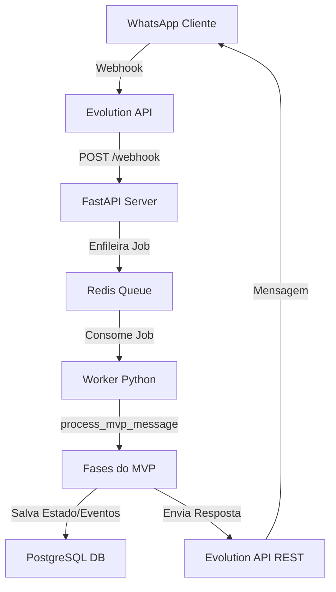

<!-- GENERATED FILE: do not edit manually. Source: .context/docs/*.md. Run ./sync.sh. -->
> Auto-generated from .context/docs | fingerprint: 17a93094466dd1a3
## architecture

# Arquitetura Técnica do MVP Refrimix

Este documento descreve o fluxo de processamento de mensagens no MVP determinístico, detalhando a pipeline de ponta a ponta desde a recepção do evento do WhatsApp até a resposta ao cliente.

## 1. Fluxo de Dados de Ponta a Ponta



### Passo 1: Recepção e Ingestão
- A mensagem do cliente chega aos servidores do WhatsApp e é entregue via Webhook à **Evolution API**.
- A Evolution API repassa o payload formatado para a rota `/webhook` exposta pelo serviço **FastAPI** do bot.

### Passo 2: Enfileiramento Resiliente
- O endpoint FastAPI parseia os metadados mínimos (remetente, texto, tipo de mensagem) e publica o evento em uma fila de mensagens gerenciada pelo **Redis**.
- Isso garante que nenhuma mensagem de cliente seja perdida em caso de picos de carga ou reinicializações do worker.

### Passo 3: Processamento pelo Worker
- O **Worker Python** assíncrono consome as mensagens do Redis de forma sequencial.
- Ele delega a mensagem do lead para o pipeline determinístico em `process_mvp_message` localizado em `app/mvp_attendance.py`.

### Passo 4: Fases de Decisão e Classificação
Quando `MINIMAL_MVP_ENABLED=1`, a tomada de ação não utiliza LangGraph pesado ou LLMs:
1. **Identificação**: Carrega ou cria o cadastro do Lead pelo telefone no banco.
2. **Extração básica**: Mapeia se na mensagem o cliente enviou o nome, tipo de serviço ou preferências.
3. **Classificação (Intent)**: `understand_message` classifica a intenção em um conjunto fechado de intents determinísticas usando expressões regulares e regras de correspondência exata de palavras.
4. **Planejamento comercial**: `plan_next_action` decide qual a próxima ação baseando-se estritamente na árvore lógica de prioridades do MVP.
5. **Formatação (Catálogo)**: `response_catalog` gera a resposta final baseada no template exato do catálogo, garantindo copy impecável e livre de segredos.

### Passo 5: Persistência e Envio
- O estado do lead (`lead_state`) e os eventos da conversa são persistidos de forma assíncrona na tabela `leads` do **PostgreSQL**.
- A mensagem de resposta finalizada é disparada de volta ao cliente chamando os endpoints REST da **Evolution API**.

---

## context

# Entendimento Macro do MVP Refrimix

Este documento define a visão de negócios e o objetivo central do MVP (Minimum Viable Product) de atendimento automático via WhatsApp para a Refrimix.

## 1. Por que reduzimos o escopo?

O projeto anterior continha uma infraestrutura complexa com múltiplos agentes inteligentes, processamento de áudio por inteligência artificial (TTS/STT), análise multimodal de imagens via Vision (Qwen-VL), roteamento avançado via Qdrant e suporte a calendários externos. 

Embora robusta tecnicamente, essa arquitetura causava:
- **Loops Conversacionais**: Clientes ficavam presos em fluxos repetitivos de perguntas sobre fotos e infraestrutura.
- **Respostas Lentificadas**: Latências de processamento dos modelos de linguagem atrasavam as respostas do atendimento.
- **Erros de Interpretação**: Mudanças sutis de contexto geravam saídas erráticas dos LLMs.

Para garantir **velocidade, estabilidade e clareza**, eliminamos as inteligências artificiais complexas do caminho crítico, transformando o bot em um sistema de decisão determinístico baseado em intents claras e respostas unificadas no catálogo.

## 2. Objetivo Principal

O objetivo central do MVP é realizar um **pré-atendimento rápido e eficiente**, guiando o cliente até duas conclusões possíveis:
1. **Instalação Simples**: Apresentar o preço fixo de **R$850** quando todos os requisitos forem atendidos.
2. **Visita Técnica / Projeto**: Agendar uma visita presencial por **R$50** caso falte alguma informação (fotos, capacidade) ou seja um serviço de manutenção/conserto.

## 3. Persona do Cliente

O cliente da Refrimix busca soluções rápidas para climatização de sua residência ou comércio. Ele quer saber **quanto custa** e **quando pode ser feito**. O bot deve se comunicar de forma amigável, clara e objetiva, evitando termos técnicos desnecessários e direcionando para o agendamento rápido sem criar bloqueios (como exigir obrigatoriamente o envio de fotos).

---

## database

# Governança de Banco de Dados e lead_state

Este documento descreve a persistência de dados no MVP, detalhando a estrutura das tabelas principais e o esquema interno da coluna JSON de controle de estado.

## 1. Schema Físico (PostgreSQL)

O bot utiliza a tabela `leads` no PostgreSQL para registrar os atendimentos e seu ciclo de vida.

### Tabela `leads`
- `id` (String / UUID): Identificador único do lead.
- `phone` (String, Unique): Número de telefone do cliente no formato internacional (ex: `5513999999999`).
- `name` (String, Nullable): Nome do cliente, extraído deterministicamente.
- `service_type` (String, Nullable): Mapeamento de serviço ativo (`instalacao`, `higienizacao`, `manutencao`, `conserto`).
- `pipeline_stage` (String): Estágio do funil de atendimento (`new`, `awaiting_service`, `awaiting_name`, `pre_agendamento`, `qualified`).
- `city_bairro` (String, Nullable): Município e bairro onde o serviço será executado.
- `lead_state` (JSONB): O estado persistente da conversa, contendo informações comerciais detalhadas.

### Tabela `lead_events`
- Registra cada mensagem enviada (`user` ou `assistant`) associada ao telefone do lead, servindo de base histórica e protegendo a integridade do pipeline conversacional.

---

## 2. Estrutura do `lead_state` (JSON)

A coluna `lead_state` guarda as variáveis que controlam o comportamento do bot em tempo de execução de forma simples e legível:

```json
{
  "nome": "Will",
  "tipo_servico": "instalacao",
  "cidade_bairro": "Guarujá - Centro",
  "btus": "12000 BTUs",
  "fotos": {
    "local_interno": true,
    "local_externo": false
  },
  "instalacao": {
    "ponto_eletrico_exclusivo": true,
    "tubulacao_existente": false,
    "distancia_aproximada": "3m"
  },
  "commercial_decision": {
    "path": "technical_visit_50",
    "visit_price": 50,
    "fixed_price": null,
    "can_schedule_now": true
  },
  "appointment": {
    "preferred_window": "tarde",
    "confirmed_window": false
  },
  "pipeline_stage": "pre_agendamento",
  "last_messages": {
    "user": "quero agendar para tarde",
    "assistant": "Seguimos como visita técnica de R$50..."
  }
}
```

---

## 3. Diretrizes de Schema e Migrations

- **Regra estrita**: Não criar novas tabelas físicas ou colunas sem plano prévio do comitê de infraestrutura.
- A coluna `lead_state` é do tipo `JSONB` especificamente para permitir a expansão de campos virtuais (ex: preferências de data ou detalhes de faturamento) sem a necessidade de rodar migrations de banco de dados (`prisma migrate`), mantendo o banco estável e sem riscos de indisponibilidade.
- Qualquer verificação de schema físico em ambiente local deve usar o validador de ambiente `.venv/bin/python scripts/validate-env.py`.

---

## decisions

# Decisões e Regras Comerciais do MVP

Este documento consolida todas as políticas comerciais oficiais adotadas pela Refrimix no MVP. Essas regras são codificadas no bot de forma determinística para evitar divergências de orçamentação.

## 1. Tabela de Preços Oficial

| Tipo de Serviço | Condições do Cenário | Preço Cobrado | Observações comerciais |
| :--- | :--- | :--- | :--- |
| **Instalação Simples** | Costa a costa, evaporadora e condensadora próximas, até 3m de tubulação, acesso fácil. | **R$ 850,00** | Inclui material básico e mão de obra. Considera ponto elétrico pronto. |
| **Higienização** | Split padrão (hi-wall), equipamento funcionando e instalado corretamente. | **R$ 200,00 / aparelho** | Se o aparelho não climatizar, vira análise de manutenção por R$50. |
| **Visita Técnica / Análise** | Manutenção geral, conserto de vazamentos, ou instalações sem dados/fotos suficientes. | **R$ 50,00** | Valor é **abatido** do preço final se o orçamento proposto for aprovado. |
| **Equipamentos Complexos** | Cassete, Piso-teto, Multi-split, Dutos, VRF/VRV ou potências superiores a 18k BTUs. | **A partir de R$ 50,00** | Tratado como visita ou projeto residencial/comercial personalizado. |

## 2. Regra de Fotos e Bloqueios

- **A foto ajuda, mas não trava**: No fluxo anterior, o cliente ficava travado em loops caso não enviasse fotos do local. 
- No MVP, se o cliente disser que não tem foto, não sabe tirar, ou o bot detectar intenção de indisponibilidade de imagens, o fluxo avança **imediatamente** para o agendamento de uma Visita Técnica de **R$50**, explicando que a análise será feita presencialmente pelo profissional.

## 3. Fluxo de Direcionamento Comercial

O bot segue a árvore de prioridade estrita de direcionamento comercial para evitar fricções com o cliente:
1. **Identificar o Nome**: Sempre capturar o nome do cliente no início da conversa para deixar o atendimento profissional e humanizado.
2. **Definir o Serviço**: Entender se é Instalação, Higienização ou Manutenção/Conserto.
3. **Validar Cenário Simples (apenas para Instalação)**: Se o cliente tem fotos/dados e o cenário é simples, oferece R$850. Se falta informação ou é complexo, oferece a Visita Técnica de R$50.
4. **Agendar Janela**: Solicitar a preferência de período (manhã ou tarde) para que o time operacional finalize o agendamento humano de forma ágil.

---

## evolution

# Integração com a Evolution API e Controle de Sessão

Este documento detalha o gerenciamento e as políticas operacionais para a **Evolution API**, que atua como nosso gateway de comunicação com o WhatsApp.

## 1. Isolamento Absoluto de Banco de Dados

- **Regra P0 Crítica**: A Evolution API **nunca** deve compartilhar o mesmo banco de dados ou a mesma URI de conexão (`DATABASE_URL`) que a aplicação do WhatsApp RAG.
- A Evolution API possui seu próprio banco de dados e schema de persistência para gerenciar chats, mídias e chaves de criptografia. Compartilhar o banco de dados corrompe os schemas e gera indisponibilidade crítica em ambos os serviços.
- Se `EVOLUTION_DATABASE_URL` estiver ausente no `.env`, recupere a chave correta do cofre local de senhas. Nunca a substitua pelo endereço do banco da aplicação.

---

## 2. Gerenciamento de Sessão e QR Code

- **Sessão Ativa**: A instância do bot roda sob o identificador parametrizado em `EVOLUTION_INSTANCE`. 
- **Proibição de Comandos Destrutivos**: Nunca envie requisições para os endpoints `/instance/logout`, `/instance/delete` ou limpe volumes Docker associados à Evolution sem autorização explícita e um plano de rollback testado.
- **Leitura de QR Code**: Em caso de desconexão da instância, o QR Code de autenticação deve ser gerado através do painel de administração da Evolution ou via chamada autenticada ao endpoint `/instance/connect`.
- **Sigilo**: Nunca imprima, capture ou versionar imagens de QR Codes ou payloads contendo as chaves de API (`EVOLUTION_API_KEY`) em arquivos públicos, respostas, ou commits do repositório.

---

## 3. Configuração do Webhook

- Para subir a Evolution API com segurança e garantindo a verificação prévia de conectividade, use sempre o script utilitário:
  `scripts/evolution-safe-up.sh`
- Este script roda testes pré-flight garantindo que a rede local do Tailscale e a porta do PostgreSQL estejam ativas antes de disparar o comando `docker compose up -d evolution-api`.
- O webhook de entrega deve apontar para o IP Tailscale estável do PC2 (`http://100.66.232.72:8000/webhook`) ou `http://localhost:8000/webhook` dependendo da topologia de contêineres adotada.

---

## playbook

# Playbook de Incidentes e Rollback do MVP

Este documento serve como guia prático de referência para os administradores do sistema em caso de falhas operacionais, indisponibilidade ou necessidade de reversão de atualizações.

---

## 1. O Bot Parou de Responder (Triagem Rápida)

Em caso de parada total nas respostas do bot, siga a ordem estrita de diagnóstico:

### Passo 1: Verificar o Healthcheck
Acesse o endpoint de saúde `/health` do servidor executando no PC2:
```bash
curl -f http://localhost:8000/health
```
- Se responder status `503 Degraded` ou falhar, observe o payload de diagnóstico. Se o banco de dados PostgreSQL ou o Redis estiverem reportando status `down`, vá para o **Passo 2**.
- Se reportar que o worker está inativo ou com heartbeat atrasado, reinicie o worker.

### Passo 2: Reiniciar a Pilha de Serviços
Caso algum serviço esteja travado na máquina local, execute o restart seguro via Docker:
```bash
docker compose restart fastapi-rag redis-rag postgres-rag
```
Para reiniciar o worker de fila:
```bash
docker compose restart worker-rag
```

---

## 2. Falhas no Redis (Estouro de Fila)

Se o Redis cair ou acumular mensagens indevidamente:
1. **Limpar a fila acumulada**: Em caso de loop de mensagens ou travamentos gerados por uma mensagem corrompida, você pode purgar a fila Redis conectando ao CLI:
   ```bash
   docker exec -it redis-rag redis-cli FLUSHALL
   ```
2. **Reiniciar a escuta do Worker**:
   ```bash
   docker compose restart worker-rag
   ```

---

## 3. Resetes Cirúrgicos de Leads para Testes

Se um lead específico (ex: número do gerente Will ou do bot) entrar em um estado conversacional inválido ou precisar ser reiniciado para fins de homologação:
Rode o script utilitário de reset cirúrgico de leads:
```bash
.venv/bin/python scripts/reset-lead.py 5513996659382
```
Este script limpa o cache Redis do telefone e remove os campos de estado conversacional do lead no PostgreSQL, retornando-o ao estágio `"new"` como se fosse o primeiro contato.

---

## 4. Estratégia de Rollback de Código

Se uma atualização em produção gerar regressões inesperadas:
1. **Reverter a Branch**: Restaure o último commit estável conhecido da branch `feature/proxima-tarefa-20260526` ou faça checkout para a `main`.
2. **Sincronizar Repositório**: Rode o script de sincronização para commit e publicação imediata no Gitea:
   ```bash
   ./sync.sh --message "fix: rollback de emergencia para versao estavel X"
   ```
3. **Reconstruir Contêineres**: Force a reconstrução sem cache das imagens do RAG:
   ```bash
   docker compose build --no-cache fastapi-rag worker-rag
   docker compose up -d
   ```

---
